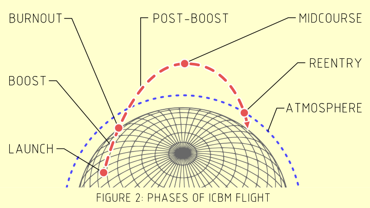

# The Strategy of Technology

  

[The Strategy of Technology](https://www.jerrypournelle.com/slowchange/Strat.html) is an analysis of how nation-states operationalize technology, primarily for military purposes. Originally written in the 1960's and published in 1970, this version contains commentary and notes provided by the authors (Pournelle, Possony, and Kane) over the intervening years until 1999. The book served as a text book for various military colleges, and it primarily references developments during the so-called Cold War. Although it has been out of print for many years now, Pournelle had intended to create a pdf version of the book, but never got around to it before his passing. As I wanted a personal pdf version for convenient reference, and this seems to be aligned in spirit with Jerry's intentions, I have made this repository which generates a layout for the book.

This is repository is an exercise in which I aim to:
  1. Become comfortable with basic LaTeX. 
  2. Generate a readable version of the document.

As stated on Jerry's website, this book is a form of shareware. You may find additional information on the landing page for [The Strategy of Technology](https://www.jerrypournelle.com/slowchange/Strat.html) about where to send funds if you find this edition of the book useful. If Dr. Possony's or Dr. Pournelle's estates wish for me to remove this repository, I will be happy to oblige.

## Minor changes
I have created higher resolution images and figures, although the original images from Dr. Pournelle's website are included in the `images` directory but are not rendered in the document. I have also made some minor formatting changes to Dr. Kane's post-chapter notes. 

## To Do:
  - Clean up fig and chart titles
  - Add background color `mdframed` charts
  - Add Dr. Kane's notes
    - Get dates for Soviet ballistic missiles
  - Get circular error probability/yield curves from RAND

